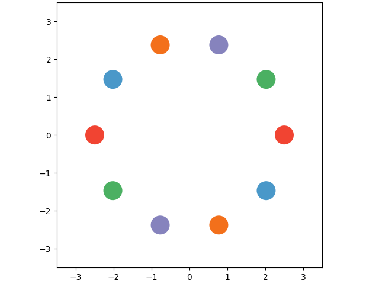
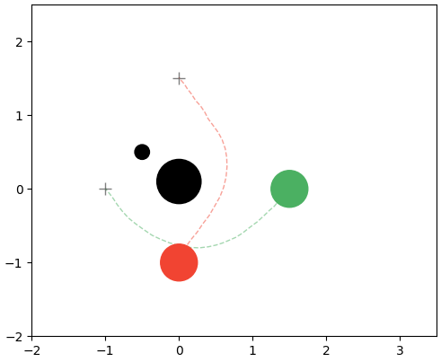

# distill-d4orm

[](https://arxiv.org/abs/2503.12204)
[](https://www.youtube.com/watch?v=WuFuecpZQSY)
[](https://github.com/astral-sh/uv)
[](https://github.com/Kei18/distill-d4orm/actions/workflows/ci.yml)

_This repository is currently under construction._

A refactored version of **D4orm**, an optimization framework for generating kinodynamically feasible and collision-fre multi-robot trajectories using an incremental denoising scheme based on diffusion models.

This codebase extends [proroklab/d4orm](https://github.com/proroklab/d4orm), which itself originates from [LeCAR-Lab/model-based-diffusion](https://github.com/LeCAR-Lab/model-based-diffusion).

## Installation

To install the required packages, run the following command:

```bash
uv sync
```

### For CUDA environments

```bash
uv sync --extra cuda12
```

## Run D4orm

```bash
uv run app.py
```

The results will be stored in the outputs/20XX directory.

To see available options:

```bash
uv run app.py --help
```

Example:

```sh
CUDA_VISIBLE_DEVICES=3 uv run app.py --n_agents 10 --anytime --Niteration 30 --save-gif
```




### Obstacles, start-goal specification

```sh
uv run -m src.d4orm.d4orm --n-agents 2 --env-name 2dholo_custom --external_file assets/2dholo_custom.yaml
```




## Citation

```bibtex
@article{zhang2025d4orm,
  title={D4orm: Multi-Robot Trajectories with Dynamics-aware Diffusion Denoised Deformations},
  author={Zhang, Yuhao and Okumura, Keisuke and Woo, Heedo and Shankar, Ajay and Prorok, Amanda},
  journal={arXiv preprint arXiv:2503.12204},
  year={2025}
}
```
